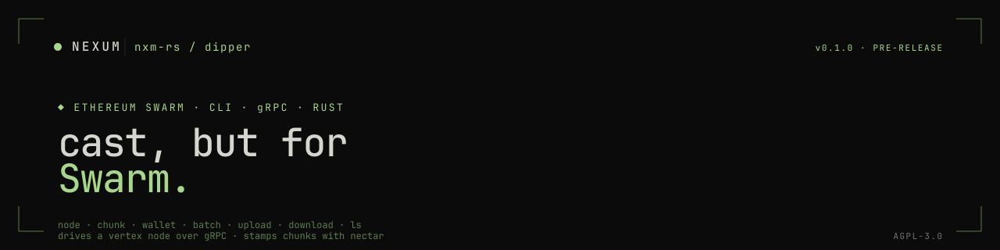

<p align="center">
  
</p>

A **`cast`-like CLI for Ethereum Swarm** in Rust. `dipper` drives a
[`vertex`](https://github.com/nxm-rs/vertex) node over gRPC and uses the
[`nectar`](https://github.com/nxm-rs/nectar) primitives to build and stamp chunks
locally - node introspection, chunk transfer, on-chain postage batches, and
mantaray manifest upload/download from one binary.

> **Pre-release** and under active development. Testnets and lab environments only.

Looking for the org overview? See **[github.com/nxm-rs](https://github.com/nxm-rs)**.

---

## Install

Build from source. `dipper` consumes `nectar` through `../nectar` path
dependencies, so check both repos out as siblings:

```bash
git clone https://github.com/nxm-rs/nectar
git clone https://github.com/nxm-rs/dipper
cd dipper
```

`cargo`/`rustc` and `protoc` (for the gRPC stubs) come from the flake dev shell:

```bash
nix develop          # provides cargo, rustc, protoc
cargo build --release
```

The binary lands at `target/release/dipper`. MSRV is Rust **1.92** (edition 2024).

## Usage

Two transports, one binary: `node`, `chunk`, and the mantaray commands speak
**gRPC to a vertex node** (`--endpoint`, default `http://127.0.0.1:1635`); `batch`
talks **directly to Ethereum** via `--rpc-url`, and `wallet address` is fully
offline. `--network <gnosis|sepolia>` (default `gnosis`) selects the address book
and expected chain id (Gnosis `100` / Sepolia `11155111`).

A `<signer>` is `--private-key 0x<hex>` or `--keystore <file>` (`--password`,
`$DIPPER_KEYSTORE_PASSWORD`, or an interactive prompt).

### node - inspect the local node

```bash
dipper node status      # overlay address, depth, peer counts (Node.GetStatus)
dipper node topology    # Kademlia bins (Node.GetTopology)
```

### wallet - keys

```bash
dipper wallet address --private-key 0x<32-byte-hex>
dipper wallet address --keystore ./key.json          # prompts for password
```

### chunk - single content chunks

```bash
# Upload one content chunk (<= 4096 bytes), stamped with a postage batch
dipper chunk upload ./hello.txt \
    --batch-id 0x<batch> --depth 20 --bucket-depth 16 --private-key 0x<hex>

# Download a chunk's payload (use --raw for the span + payload wire body)
dipper chunk download <addr> --out ./out.bin
```

### batch - on-chain postage batches

The `batch` commands drive the Swarm `PostageStamp` contract over `--rpc-url`.
BZZ is a **16-decimal** token; `--amount` is the balance *per chunk*. `bucket-depth`
must be `16` to match bee.

```bash
dipper batch create --amount <bzz> --depth <d> [--bucket-depth 16] \
        [--immutable] [--owner <addr>] [--nonce 0x<32b>] <signer>
        # BZZ.approve(total) then createBatch; total = amount * 2^depth.
        # Prints the authoritative batchId from the BatchCreated receipt.
dipper batch topup  --batch-id 0x<id> --amount <bzz> <signer>   # topUp; uses stored depth
dipper batch dilute --batch-id 0x<id> --depth <newDepth> <signer>  # increaseDepth
dipper batch info   --batch-id 0x<id>   # owner / depth / bucketDepth / immutable / balance
```

### upload / download / ls - mantaray manifests

Multi-chunk file, directory, and `.tar.gz` upload/download via mantaray
manifests, stamped with an existing batch.

```bash
dipper upload <path> --batch-id 0x<id> --depth <d> [--bucket-depth 16] \
        [--index-document index.html] [--error-document <name>] <signer>
        # <path>: a file, a directory tree, or a .tar.gz/.tgz archive.
        # Prints the manifest root; dir/archive uploads default index to index.html.
dipper download <root> [path] [--out <target>]
        # with [path]: extract one file. Without it: rebuild the whole tree under --out.
dipper ls <root> [--long]   # list entries (addr / content-type / path); --long adds size
```

```bash
# Buy a batch, upload a website directory under it, then pull it back
dipper batch create --amount 1.0 --depth 20 \
    --rpc-url https://rpc.gnosischain.com --private-key 0x<hex>
dipper upload ./site --batch-id 0x<batch> --depth 20 --private-key 0x<hex>
dipper ls 0x<root> --long
dipper download 0x<root> --out ./site-copy
```

## How it works

`dipper` is a fat client: the [`vertex`](https://github.com/nxm-rs/vertex) gRPC API
is a thin transport (chunk push/retrieve and node status), so all chunking, BMT
hashing, postage stamping, and mantaray manifest assembly happen locally via
[`nectar`](https://github.com/nxm-rs/nectar). On-chain batch operations are plain
Ethereum transactions against the `PostageStamp` contract (alloy), with the
deployed addresses sourced from `nectar-contracts` so they stay in lockstep with
the node.

## Sibling repos

| Repo | What it is |
| --- | --- |
| [nectar](https://github.com/nxm-rs/nectar) | Low-level Swarm primitives in Rust - BMT, chunks, postage, mantaray, contract bindings |
| [vertex](https://github.com/nxm-rs/vertex) | Swarm node in Rust, bee-compatible - `dipper`'s gRPC counterpart |
| [swarm-contracts](https://github.com/nxm-rs/swarm-contracts) | The Swarm storage-incentives contracts (Foundry) |
| [swips](https://github.com/nxm-rs/swips) | Swarm Improvement Proposals |

## Contributing

Open an issue before non-trivial PRs. Conventional Commits; `cargo fmt` and
`cargo clippy --all-targets -- -D warnings` must be clean; tests for behavioural
changes are not optional. By contributing you agree to the [CLA](./CLA.md).

## Security

See [SECURITY.md](https://github.com/nxm-rs/.github/blob/main/SECURITY.md) or email `security@nxm.rs`.

## License

AGPL-3.0-or-later. See [LICENSE](./LICENSE).

```
●  AGPL-3.0  ·  pre-release  ·  cast for Swarm, over a vertex node
```
